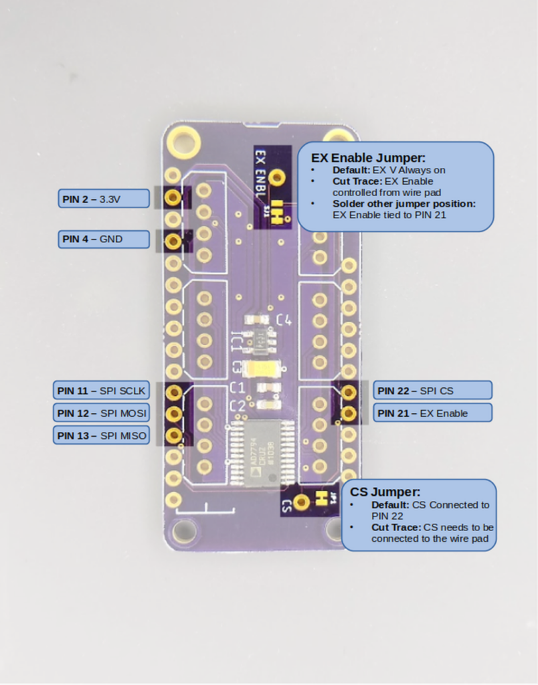
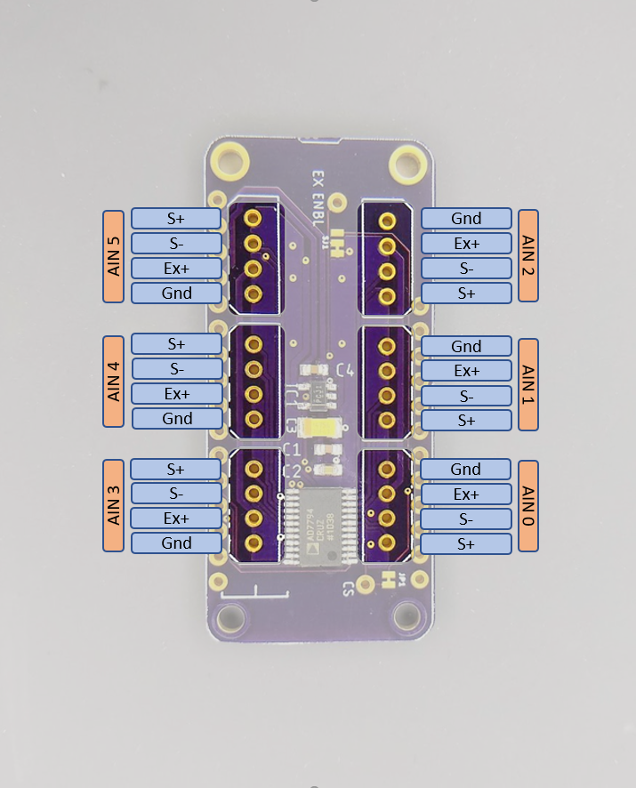
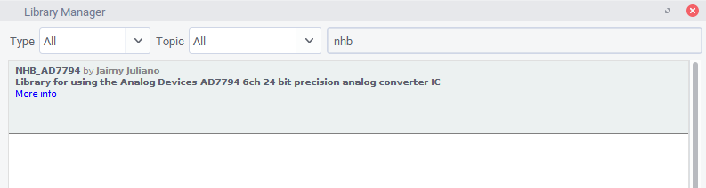
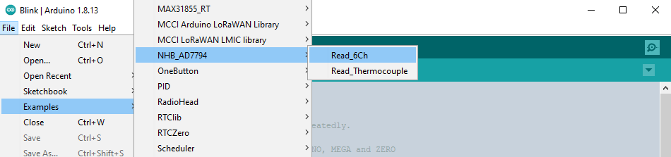
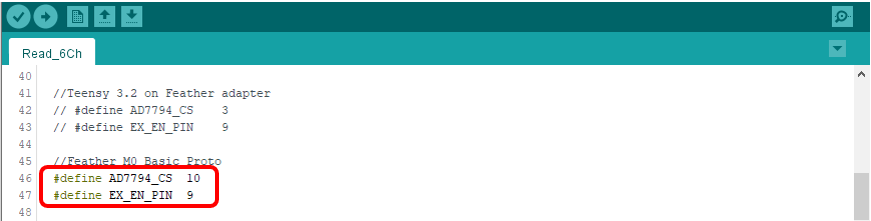

# 6 Channel, 24-bit FeatherWing

<!-- *By Jaimy | November 19, 2020* -->


### Description

This is a simple but versatile [Feather](https://learn.adafruit.com/adafruit-feather/feather-specification) compatible board. It uses an [AD7794](https://www.analog.com/media/en/technical-documentation/data-sheets/AD7794_7795.pdf), a very robust 6 channel 24 bit ADC. It's a relatively slow converter (470 Hz Max – single channel), but this board is really suited for lower power, monitoring type applications and can consume as little as 2 μA in standby. It has an on-board 2.5 V regulator for excitation voltage and is designed primarily to read load cells and pressure gauges. However, it can also be used to read any ratiometric sensor (such as potentiometers), thermocouples, or any 0 – 3.3 V signal.

#### Specs

- RMS noise down to 40 nV at lowest data rate (4.17 Hz)
- Power-down current: 1 μA maximum (AD7794 chip)
- Low noise, programmable gain, instrumentation amplifier
- Band gap reference with 4 ppm/°C drift typical
- Simultaneous 50 Hz/60 Hz rejection
- Update rate: 4.17 Hz to 470 Hz
- Six differential analog inputs
- 4 pin connections with excitation and ground for each channel
- On board 2.5v LDO with enable pin broken out to turn off excitation for low power applications

This guide assumes you are familiar with the basics of working with the Arduino IDE and using Arduino compatible boards. While this is designed as a "FeatherWing" board, it can also be used with other Arduino boards, either in a breadboard, or directly wired.

---

### Pinouts

#### FeatherWing Pins



| Pin | Function |
|-----|----------|
| **Pin 2** | 3.3V Power In |
| **Pin 4** | Ground |
| **Pin 11** | SPI SCLK |
| **Pin 12** | SPI MOSI |
| **Pin 13** | SPI MISO |
| **Pin 21** | EX Enable (depends on jumper) |
| **Pin 22** | SPI CS (default) |

*All other pins are NC (No connection)*

- The **CS Jumper** determines if SPI Chip Select is connected to **Pin 22**. If cut, you must wire the CS wire pad to another pin.
- The **EX Enable** jumper sets excitation mode. The default setting is 2.5 volt excitation voltage is always ON. If you cut the jumper trace, the excitation voltage is controlled by the wire pad. If you cut the jumper trace and solder the other jumper position closed, the excitation voltage will be controlled by pin 21.

#### Sensor Input Pins



For each input there is a group of 4 pins that follows the following convention.

| Pin | Function |
|-----|----------|
| **GND** | Signal ground |
| **EX+** | 2.5V excitation voltage |
| **S-** | Signal (-) |
| **S+** | Signal (+) |

Note that the input group pin order is rotated around the board, not mirrored. This is to accommodate the use of polarized connectors for sensor cables.

### Installing the Library

An Arduino library for using the AD7798 ADC chip is available through the Arduino library manager. To install open up the library manager and type "NHB_AD7794" into the search bar. (You probably won't have to type more than the *nhb* part)



If you prefer to install manually you can download or clone the repository from here: [https://github.com/NHBSystems/NHB_AD7794](https://github.com/NHBSystems/NHB_AD7794) This is also where you can find the API documentation for the library.

### Running the Example Sketch

From File->Examples select the Read_6Ch example



Once opened, you will need to change the pin assignments to suit your board (unless you happen to be using a Feather M0 Basic)



That is probably all you have to change for the example to run, however there are a couple of other things you may want to change depending on your setup.

### Other Modifications

The example waits for a serial connection before starting. You can comment out the following line if that is not what you want.

```javascript
while(!Serial);
```

If your application doesn't use the EX Enable pin, you can probably get rid of these 2 lines.

```javascript
pinMode(EX_EN_PIN, OUTPUT);
digitalWrite(EX_EN_PIN,LOW);  //low  = 2.5 Vex ON
```

Finally, depending on what you are trying to measure, you may want to edit the following to suit your needs. The default settings are good for reading load cells or strain gauges as fast as possible.

```javascript
adc.setUpdateRate(470);

for(int i=0; i < 6; i++){
  adc.setBipolar(i,true);
  //delay(2);
  adc.setGain(i, 128);
  //delay(2);
  adc.setEnabled(i,true);
  //delay(2);
}
```

**setUpdateRate()** Sets the output data rate and filtering for all channels. It is the rate at which a single channel is converted and filtered. This is not the sampling rate you can expect to see if reading multiple channels. The actual output rate (especially if reading all 6 channels) will be significantly slower. The example setting of 470Hz is the fastest rate, but it may result in noisier readings. A setting of 19.6 will enable 90 dB of 60 Hz noise rejection. The following table shows a subset of valid settings. Refer to the data sheet for the full list, however these are the only ones I ever use.

| Freq (Hz) | Settling time (ms) | Noise Rejection |
|-----------|-------------------|-----------------|
| 470 | 4 | — |
| 19.6 | 101 | 90 dB (60 Hz only) |
| 16.7 | 120 | 90 dB (50 Hz only) |
| 12.5 | 200 | 80 dB (50/60 Hz) |
| 10 | 300 | 69 dB (50/60 Hz) |
| 4.17 | 480 | 69 dB (50/60 Hz) |

**setGain(ch, gain)** Sets the programmable gain amplifier for the specified channel. Valid values are 1, 2, 4, 8, 16, 32, 64, and 128. Higher gain = more sensitive, but smaller measurement range.

**setBipolar(ch, isBipolar)** Sets whether the given channel is converted as a bipolar signal (+/- 1.25V), or a unipolar (0V-2.5V) signal. If you are reading load cells, strain gauges, or *thermocouples, you want bipolar. If you are reading a potentiometer or thermistor, you probably want unipolar. ***NOTE: Bipolar mode does not mean the device can tolerate voltages that are negative with respect to GND!***

**setEnabled(ch, isEnabled)** Sets whether or not (you guessed it) the channel is enabled. If you are using the channel, it should be enabled, pretty straightforward.

*\* Reading thermocouples requires soldering the bottom side jumpers for the desired channel closed to enable the 1M bias resistors. While it is technically possible to read thermocouples on channels 0 through 2 with the right settings, I find that the results are a little noisy.*

### Additional Info

More details about the library API can be found in the Readme of the GitHub repo located here: [https://github.com/NHBSystems/NHB_AD7794](https://github.com/NHBSystems/NHB_AD7794)

There is a second example included with the library named *Read_Thermocouple.ino* that shows how to read a Type K thermocouple including functions to handle the scaling and linearization. *Remember that you need to solder the bias resistor jumpers closed on the channel you are reading the thermocouple on.*

[](https://www.tindie.com/stores/nhbsystems/)
