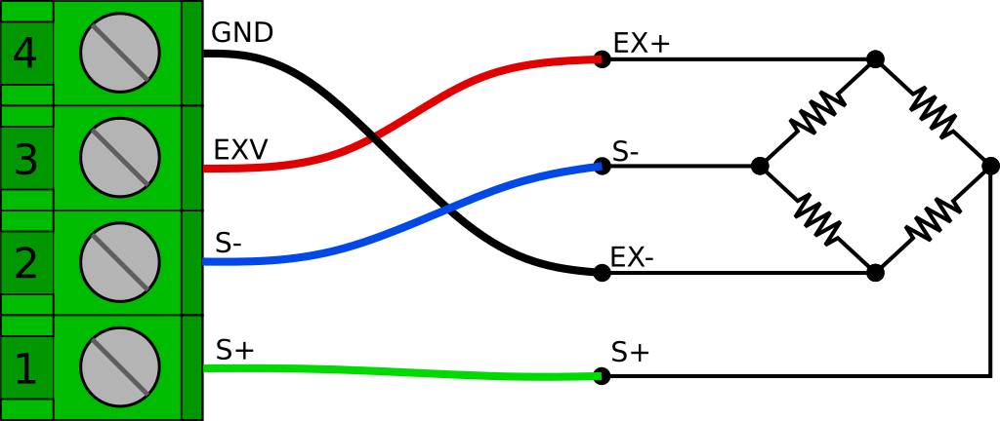
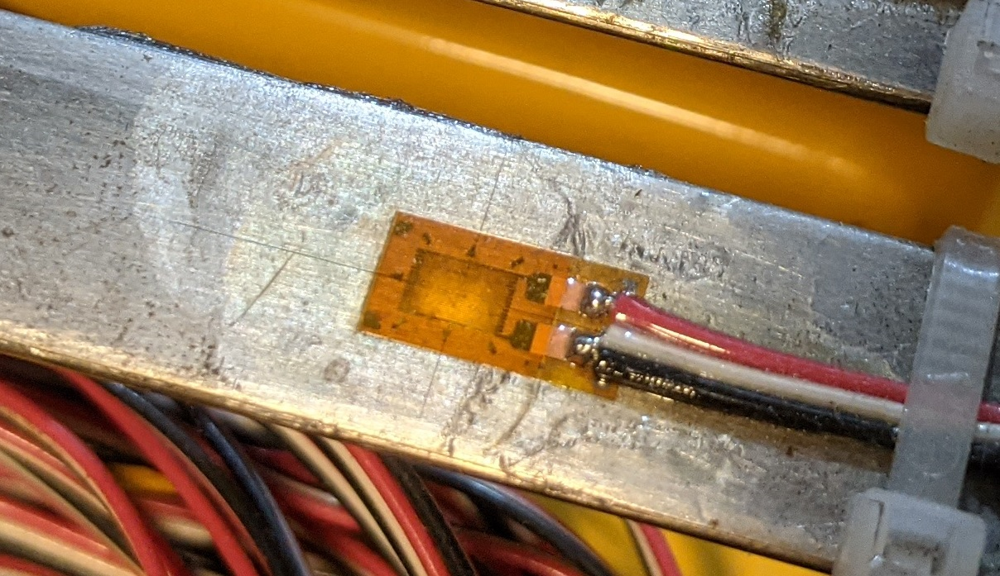
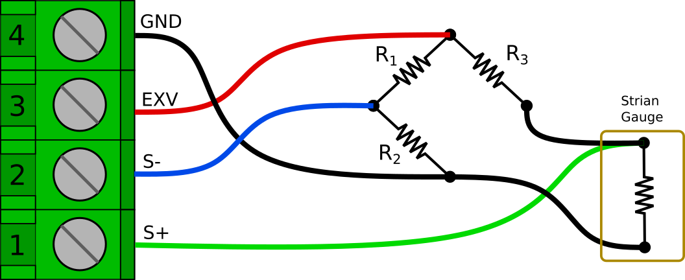
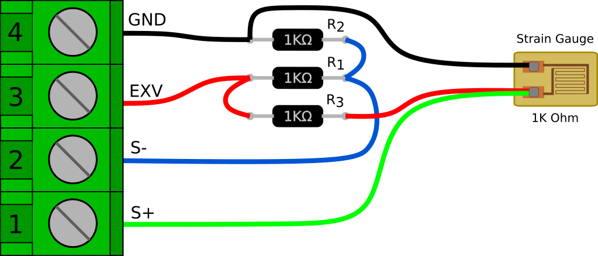
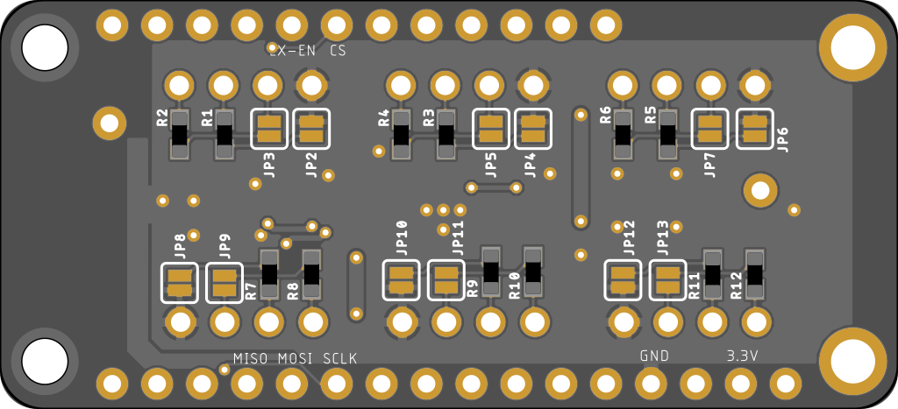
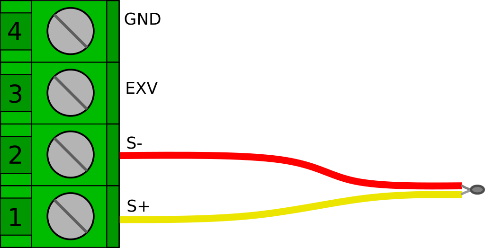
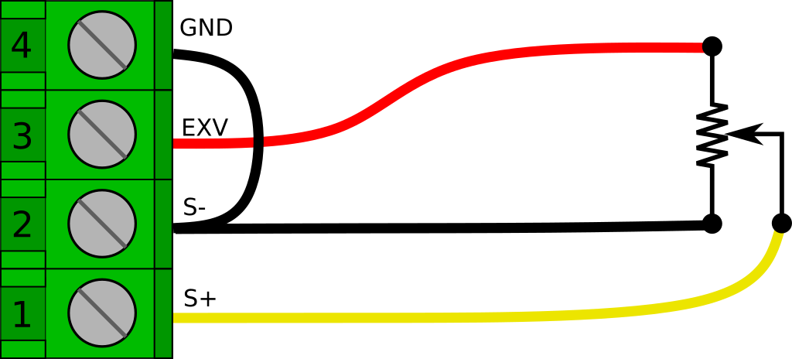

# Reading Analog Sensors

*By Jaimy | March 28, 2021*

This is a quick guide on how to connect various analog sensors to the [6 Channel, Full Bridge FeatherWing](https://www.tindie.com/products/17170/). I'll try to give a little background on some of the sensor types, but this is not intended to be a detailed explanation of the underlying principles. Hopefully this will be enough to get you going in your potential application.

## Wheatstone Bridge Sensors

A [Wheatstone bridge](https://en.wikipedia.org/wiki/Wheatstone_bridge) is a classic analog circuit for measuring an unknown resistance or perhaps more importantly, very small changes in resistance. Sensors that utilize Wheatstone bridges are usually referred to simply as "bridge" or "bridge output" sensors. They are most commonly associated with strain gauge based sensors, though they can also be used for other resistive sensors like RTDs and thermistors. For right now I will just focus on strain gauge circuits.


*Basic Wheatstone bridge Circuit*

### Full Bridge Sensors

*-Standard (non-amplified) load cells, pressure gauges, etc.-*

The most common (and easiest to use) type of strain gauged bridge sensor is the ***full bridge***. In this configuration, all 4 of the bridge resistance elements are contained in the sensor. The most common use of full bridge sensors are for load cells and pressure gauges. Generally in these sensors all bridge elements are active, meaning all four vary with external stimulus. However some special applications may have 2 or 3 passive *bridge completion* resistors and only 1 or 2 elements are active. Fortunately, for this type of sensor, it really doesn't matter how it's configured on the inside, they are all treated the same – as a full bridge sensor.

The output signal of a full bridge sensor is a very small voltage that is fraction of the input, or *excitation* voltage. The expected output of a bridge sensor is usually stated as it's mV/V output (millivolts per volt of excitation), at the full scale of the sensor. For example, if you have a 100 lb. load cell, and it's stated output is 2.2 mV/V, it will read 2.2 mV for every volt of excitation, when 100 lbs. of force is applied to it. Common output values for bridge sensors range from 1 mV/V to 4 mV/V. These outputs are too small to read accurately with the built in ADCs on most microcontrollers, which is why we typically need something like the AD7794. It has a programable gain amplifier and 24 bits of resolution to accurately read such small voltages.

*Note: I have seen some cheap "load cells" out there that are actually only a **quarter bridge** or **half bridge** device. These need to be handled differently and will be discussed later.*

Wiring up a full bridge sensor to the FeatherWing is actually quite easy (it is the main thing it was designed for). The general configuration is 4 wires. Two wires for the excitation voltage (usually marked as EX+ and EX-) and two wires for the output signal (usually marked as S+ and S-). They can be wired directly into the 4 terminals of any of the six available sensor input channels as shown below. This is the same the same for a load cell, pressure gauge, or any other full bridge sensor. You can safely reverse the polarity of the output signal by swapping the S+ and S- leads.


*Bridge sensor connection to sensor input channels*

There is often a shield wire too. Technically, the shield should be connected to a conductive enclosure if you have one. However if you don't have a conductive enclosure around your project, you may find that tying it into the GND connection helps with noise. In some circumstances though, it can actually create more problems (like if the load cell body at the other end is in contact with a different ground potential) so don't always assume that it will be better.

We will need set the AD7794 to Bipolar mode. We will also want to set gain to 128, though some higher output sensors, or an very unbalanced bridge (large zero offset) may need it set to 64 to see the full output range.

```cpp
AD7794 adc(AD7794_CS, 4000000, 2.50);

void setup() {
   ...
   adc.begin();
   ...
   int ch = 0;  //Channel bridge sensor is on
   ad7794.setBipolar(ch, true);
   ad7794.setGain(ch, 128);
   ad7794.setEnabled(ch, true);
   ...
}
```

To read the sensor we first need to read the voltage

```cpp
float rawVolts = ad7794.read(ch);
```

And then we need to scale it. We will convert *rawVolts* to mV/V by multiplying by 1000, and dividing by the excitation voltage. Then we will multiply by the scaling factor that we can get from the mV/V rating of the load cell (or better yet, obtained from a calibration). We can use a simple function like below to handle this.

```cpp
float voltsToEngUnits(float vIn, float vEx, float scaleFactor){
   float mVpV = (vIn * 1000) / vEx;
   return mVpV * scaleFactor;
 }
```

As an example, I have a small 10 lb. load cell I like to use when trying things out at my desk. It has a nominal rated output of 2 mV/V. In this case my scaling factor would be 5.00 (**10 lb**. **/** *2 mV/V* **=** 5.00 **)** and If I am using the AD7794 FeatherWing, the provided excitation voltage will be 2.50 V. So I can get my scaled output like this.

```cpp
const float vEx = 2.500;
const float factor = 5.000;

float loadLbs = voltsToEngUnits(rawVolts, vEx, factor);
Serial.println(loadLbs);
```

Of course you usually wont have such nice round numbers in a real application.

*If you wanted to be really precise, or use an externally supplied excitation voltage, you could measure the excitation voltage on another channel (using the internal reference voltage) and use the measured voltage in the calculation. This is also how you could implement a 6 wire bridge connection that adds remote sense connections to compensate for voltage drop of the excitation voltage over very long cable runs. These are special cases and are beyond the scope of this guide, at least for right now.*

### Quarter Bridge Sensors

A quarter bridge (or 1/4 bridge) sensor consists of only a single resistive sensing element. The rest of the Wheatstone bridge circuit needs to be completed by ***bridge completion resistors***. The most common 1/4 bridge sensor by far is a single [strain gauge](https://en.wikipedia.org/wiki/Strain_gauge), so that is what we'll focus on here.


*A strain gauge installed on a steel beam*

Strain gauges come in 3 common resistances; 120 Ohm, 350 Ohm, and 1000 Ohm. I recommend the 1000 Ohm variety for 2 reasons. First, they draw less current. This is obviously good if your trying you're running off a battery, but also because strain gages can drift due to self heating. Less current means less self heating, and therefore less drift. The second reason is that 1000 Ohms is a common resistance. Bridge completion resistors need have extremely tight tolerances and (perhaps more importantly), they need to have extremely small temperature coeffects. It can be much easier to find an acceptable 1000 Ohm resistor than a 120 or 350. The latter can be hard to find, and you could end up paying quite a bit for a single resistor.

Electrically speaking, the circuit is basically the same as the full bridge. In this case however, only one of the 4 resistances is a sensing element, and it is typically located at the end of some length of wire and bonded to the item you are testing. R1 through R3 are simply precision resistors.


*Quarter bridge circuit*

Another subtle difference is that the S+ connection should be connected at the strain gauge, not at the bridge completion resistor. This is to reduce the effects of the strain gauge lead wire resistance on the bridge circuit. For more details about why this is done see [Micro Measurements Tech Tip 612](http://www.vishaypg.com/docs/11092/tt612.pdf).

Here is another illustration of how things could be wired up. This is easy to do on a breadboard, but can also easily be done free-hanging and wrapped in heat shrink to make an adapter cable.



It's also worth noting that you could swap the strain gauge and R3 positions in the bridge. In fact that is the way this circuit is usually depicted (including in tech tip linked above). However, there is one thing I don't like about having the strain gauge on the high side of the bridge. If the gauge lead wire becomes cut or damaged, the excitation voltage could be shorted to GND. With the gauge on the low side of the bridge, the R3 resistance would still be in series if the leads are shorted.

Now we have a full bridge and we can get the raw voltage reading the same way as the full bridge example above. We will want our channel set to bipolar, with a gain of 128.

```cpp
int ch = 0;  //Channel bridge sensor is on
ad7794.setBipolar(ch, true);
ad7794.setGain(ch, 128);
ad7794.setEnabled(ch, true);
```

And then we read the voltage.

```cpp
float rawVolts = ad7794.read(ch);
```

The only difference is in the way that we scale the readings. Strain is measured as a ratio of elongation for a given ***gauge length*** (inch/inch, mm/mm) and is generally represented by an epsilon '**𝜺**'. However, because a strain value of 1.0 would actually be an extremely large amount of elongation, strain is usually expressed as *microstrain* or ***µ***𝜺**.

To scale our voltage reading to microstrain, we need to know the ***gauge factor*** of the gauge. The gauge factor is the ratio of change in resistance to a change in length (strain). Each package of strain gauges should come with a gauge factor. It is generally right around 2.

To convert our raw voltage to microstrain we can use the following function:

```cpp
//Conversion for 1/4 bridge strain gauge
float voltsToMicrostrain(float vIn, float vEx, float gFactor) {
  
//First get volts per volt of excitation
  float Vr = vIn / vEx;
 
  //Calculate and return microstrain
  return 1E6 * ((4 * Vr) / (gFactor * (1 +  (2 * Vr)))); 
}
```

Then all we have to do is just call the function for any channels we are reading strain on.

```cpp
float strainVal = voltsToMicrostrain(rawVolts, 2.5, 2.00);
```

## Thermocouples

A [thermocouple](https://en.wikipedia.org/wiki/Thermocouple) is a type of temperature sensor that produces a small temperature-dependent voltage across a junction of two different metals. The metal alloys used determine critical characteristics such as output voltage (sensitivity), temperature range, and corrosion resistance. There are many standard alloy combinations that are designated simply as thermocouple "types", and are denoted by a single letter designation. For example, one of the most popular general use thermocouples is the Type K, which uses [chromel](https://en.wikipedia.org/wiki/Chromel) and [alumel](https://en.wikipedia.org/wiki/Alumel), and has a working range of −200 °C to +1350 °C.

Thermocouples are very easy to hook up to the AD7794 FeatherWing, at least electrically speaking. They are however much more complicated from a code/mathematical perspective.

The first thing you need to do to read a thermocouple on the FeatherWing is solder some jumpers closed on the underside of the board. This connects a pair of 1M Ohm bias resistors to the S+ and S- inputs. There are 2 jumpers for each channel. Both jumpers must be soldered closed for each channel you plan to use with a thermocouple.


*Bottom side solder jumpers*

The reason for this is that thermocouples can output a negative voltage (with respect to ground) and the AD7794 can't actually read a truly negative voltage. The "bipolar" range of the AD7794 is actually centered around the mid point between 0V and VCC. There is also an added benefit to using the bias resistors. If the thermocouple wire is cut or disconnected, the resistors will pull S+ to EXV and S- to GND. This can make it easy to detect that there is a problem with the connection.

*Technically speaking, you can read thermocouples on channels 0, 1, and 2 of the AD7794 without the external bias resistors by enabling on-chip bias resistors that are available on those channels. In my experience though, they seem to be a little noisier and less stable.*

Once the two jumpers are closed, we simply need to wire the thermocouple to the S+ and S- terminals. Thermocouple wire color codes can be a little strange. In the US a Type K thermocouple will probably have a red negative lead, and a yellow positive lead as depicted in the image below. However, many countries have there own standards. I have ordered some from amazon and received the German standard which is red positive, and green negative. Fortunately, if you get it backwards it wont hurt anything, and it will be pretty obvious (the indicated temperature will go down when heat is applied)


*Thermocouple connection*

As mentioned above, hooking up a thermocouple is easy, but they are a bit more complicated to read mathematically speaking. I am not going to dig into the math in this post, but detailed information about the calculations can be found [here](https://en.wikipedia.org/wiki/Thermocouple), [here](https://instrumentationtools.com/thermocouple-calculations/), and [here](https://srdata.nist.gov/its90/type_k/kcoefficients.html). Basically we need to approximate the NIST lookup tables for a given thermocouple type with a polynomial equation. But we also need to apply "cold junction" temperature compensation, which requires calculating an offset voltage by using a set of inverse coefficients.

To get this done, at least for Type K thermocouples, we can use some nice little functions that I originally found in this [repository](https://github.com/annem/AD7193/blob/master/examples/AD7193_Thermocouple_Example/Thermocouple_Functions.ino)

```cpp
float Thermocouple_Ktype_VoltageToTempDegC(float voltage) {
   // http://srdata.nist.gov/its90/type_k/kcoefficients_inverse.html
   float coef_1[] = {0, 2.5173462e1, -1.1662878, -1.0833638, -8.9773540e-1};            // coefficients (in mV) for -200 to 0C, -5.891mv to 0mv
   float coef_2[] = {0, 2.508355e1, 7.860106e-2, -2.503131e-1, 8.315270e-2};            // coefficients (in mV) for 0 to 500C, 0mv to 20.644mv
   float coef_3[] = {-1.318058e2, 4.830222e1, -1.646031, 5.464731e-2, -9.650715e-4};    // whoa, that's hot...
   int i = 5;  // number of coefficients in array
   float temperature;

   float mVoltage = voltage * 1e3;

   if(voltage < 0) {
    temperature = power_series(i, mVoltage, coef_1);
   }else if (voltage > 20.644){
    temperature = power_series(i, mVoltage, coef_3);
   }else{
    temperature = power_series(i, mVoltage, coef_2);
   }

   return(temperature);
}

float Thermocouple_Ktype_TempToVoltageDegC(float temperature) {
  // https://srdata.nist.gov/its90/type_k/kcoefficients.html
  float coef_1[] = {0, 0.3945013e-1, 0.2362237e-4, -0.3285891e-6, -0.4990483e-8};               // coefficients (in mV) for -270 to 0C, -5.891mv to 0mv
  float coef_2[] = {-0.17600414e-1, 0.38921205e-1, 0.1855877e-4, -0.9945759e-7, 0.31840946e-9}; // coefficients (in mV) for 0 to 1372C, 0mv to ....
  float a_coef[] = {0.1185976, -0.1183432e-3, 0.1269686e3};
  int i = 5;  // number of coefficients in array

  float mVoltage;
  float a_power = a_coef[1] * pow((temperature - a_coef[2]), 2);
  float a_results = a_coef[0] * exp(a_power);

  if(temperature < 0) {
    mVoltage = power_series(i, temperature, coef_2) + a_results;
  } else {
    mVoltage = power_series(i, temperature, coef_1);
  }

  return(mVoltage / 1e3);
}

float power_series(int n, float input, float coef[])
 {
      //delay(10);      
      int i;
      float sum=coef[0];
      for(i=1;i<=(n-1);i++)
           sum=sum+(pow(input, (float)i)*coef[i]);
      return(sum);
 }
```

If we paste these into our sketch, the rest becomes pretty straight forward.

First lets set up our channel for reading a thermocouple. A Type K thermocouple has an approximate sensitivity of 41 µV/°C and a range of −200 °C to +1350 °C, therefore we are looking at a voltage output of roughly -8 mV to +55 mV. To use the full range of a Type K thermocouple we will set the gain to 32. This gives us a range of ±78.125 mV. In setup() we need to do the following for each channel that we will be using to read a thermocouple.

```cpp
int ch = 0;  //Channel thermocouple is on
ad7794.setBipolar(ch, true);
ad7794.setGain(ch, 32);  // ±78.125 mV
ad7794.setEnabled(ch, true);
```

Now we need to measure our cold junction temperature. For this example we will use the temperature sensor built in to the AD7794. For many applications this will work fine. If you need more accuracy, you can calibrate the onboard sensor against an external reference thermometer, or you could use an additional external digital temp sensor.

```cpp
//Reading channel 6 returns the temperature
//from the onboard sensor in degrees C  
adcTemperature = adc.read(6);
```

Next we calculate the the voltage offset for the cold junction compensation.

```cpp
//Calculate the reference voltage for the cold junction 
float referenceVoltage = Thermocouple_Ktype_TempToVoltageDegC(adcTemperature);
```

Then we read the voltage and convert to temperature.

```cpp
float reading = Thermocouple_Ktype_VoltageToTempDegC(adc.read(i) + referenceVoltage);
```

If reading multiple thermocouples, we already have our cold junction reference voltage so all we have to do is repeat the last line for each channel we have a thermocouple on. For example, If all 6 channels are being used for thermocouples we can just do this.

```cpp
for(int i=0; i < 6; i++){
    readings[i] = Thermocouple_Ktype_VoltageToTempDegC(adc.read(i) + referenceVoltage);
}
```

## Potentiometers

[Potentiometers](https://en.wikipedia.org/wiki/Potentiometer) are a variable resistor generally consisting of a resistive element and a "wiper" that moves along that resistive element. This creates a voltage divider that varies the voltage that is read on the wiper. They are extremely common and you have almost certainly used one before. There are some very high quality, precise potentiometers out there that can be excellent for some displacement sensing applications. They can be great for long term, low power applications as long as you turn off the excitation voltage, they consume no power at all. They are however not well suited for high cycle applications because the contact between the wiper and the resistive element can wear out.

I have used string potentiometers, or "string pots" (also called "draw-wire" sensors) for many tests and structural monitoring projects over the years.

Potentiometers are very easy to read with the AD7794 FeatherWing. All you need is a short bit of jumper wire to connect the GND terminal to the S- terminal.


*Potentiometer wiring*

The output voltage range will be 0.0 to 2.5 V, so we will need to set the appropriate AIN channel on the AD7794 to Unipolar mode and a gain of 1 to read it properly.

```cpp
int ch = 0;  //Channel potentiometer sensor is on
ad7794.setBipolar(ch, false);
ad7794.setGain(ch, 1);
ad7794.setEnabled(ch, true);
```

After that, we just read the voltage.

```cpp
float rawVolts = ad7794.read(ch);
```

If we are just reading a regular old potentiometer, the voltage might be all we are trying to measure, or we might calibrate it for some specific measurement. However If we are reading an off the shelf displacement sensor, it will probably have a scaling factor rated in UNIT/V/V (where UNIT is inches or millimeters). This is basically handled in the same way as the full bridge example above.

```cpp
float voltsToUnits(float vIn, float vEx, float scaleFactor){   
   return (vIn / vEx) * scaleFactor;
 }
```

---

**Tags:** bias resistor, completion resistor, full bridge, load cell, quarter bridge, strain gauge, thermocouple, wheatstone bridge
