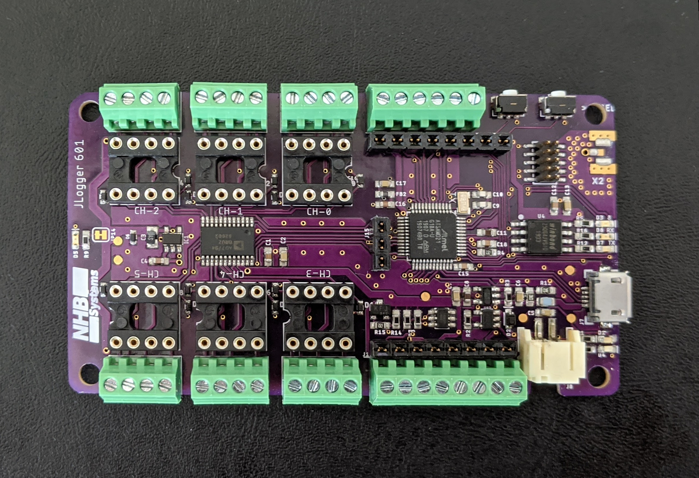
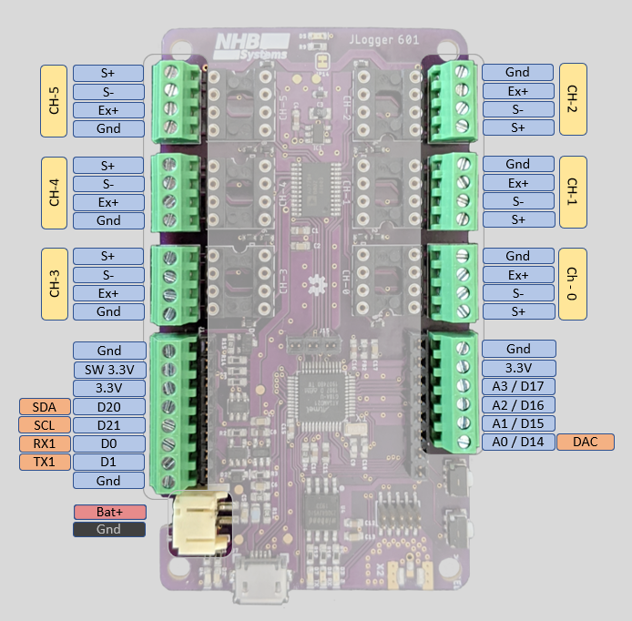
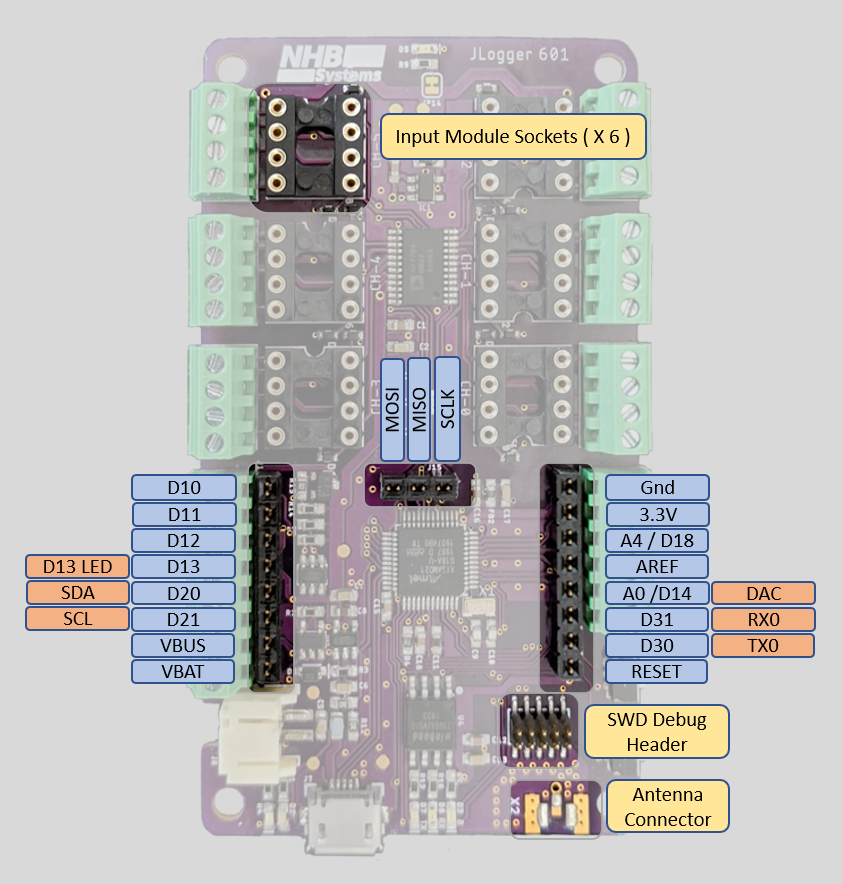
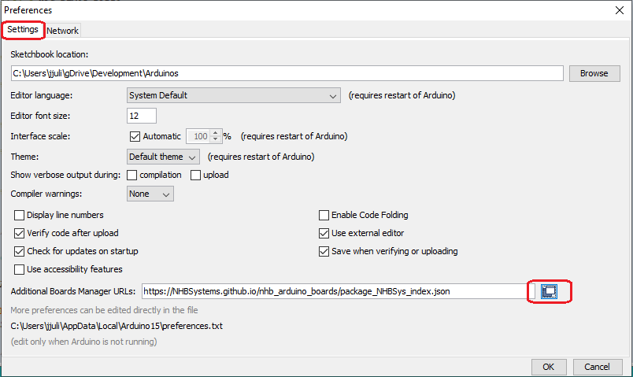
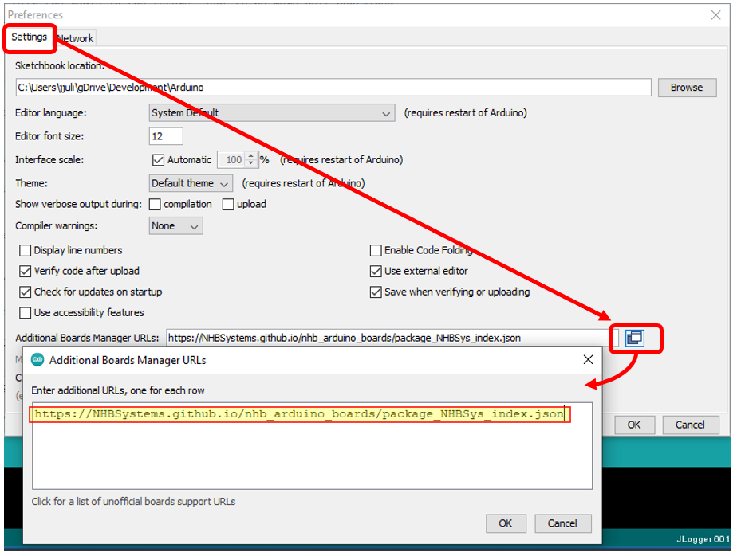
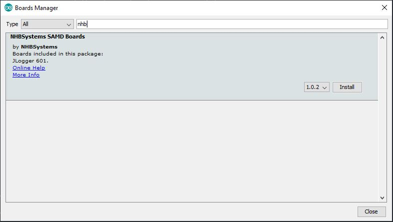
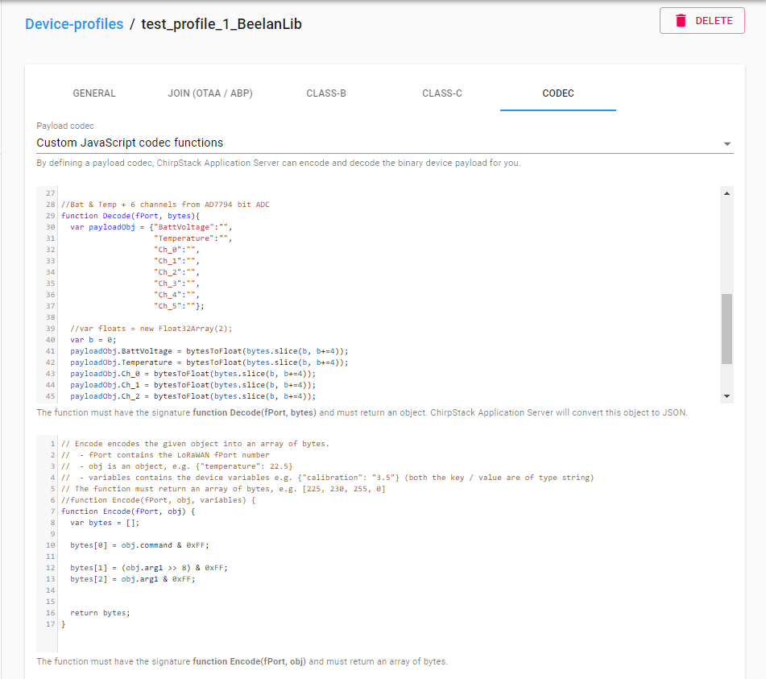
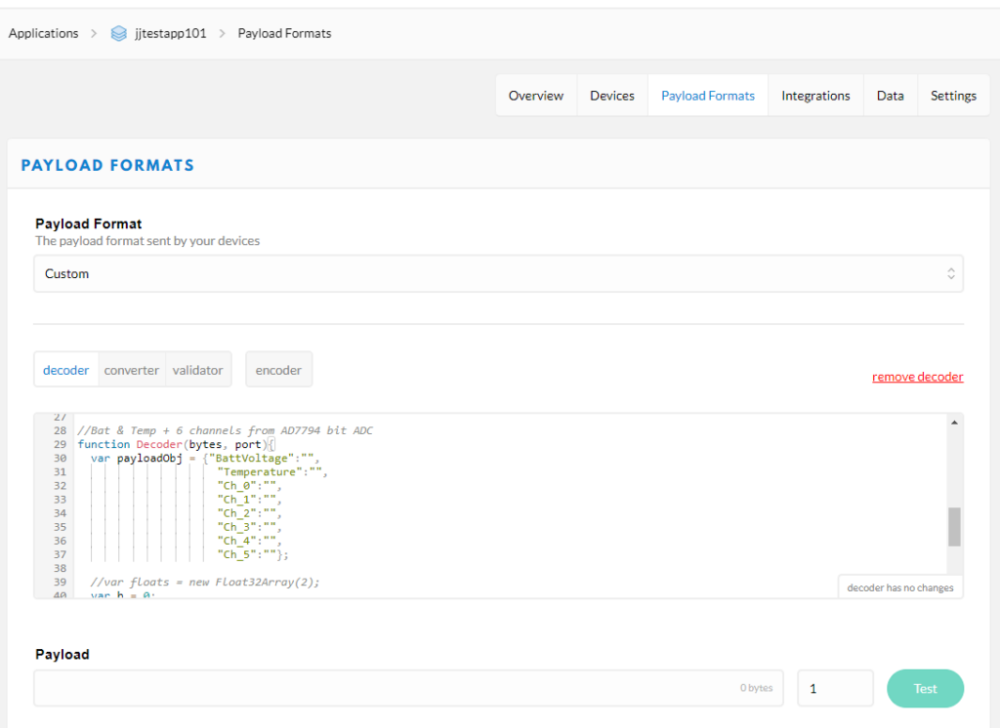
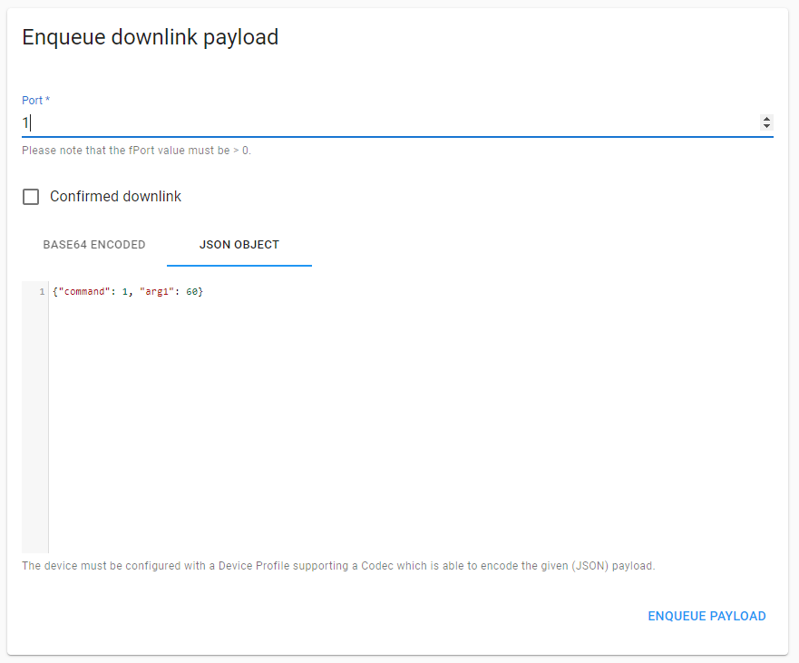
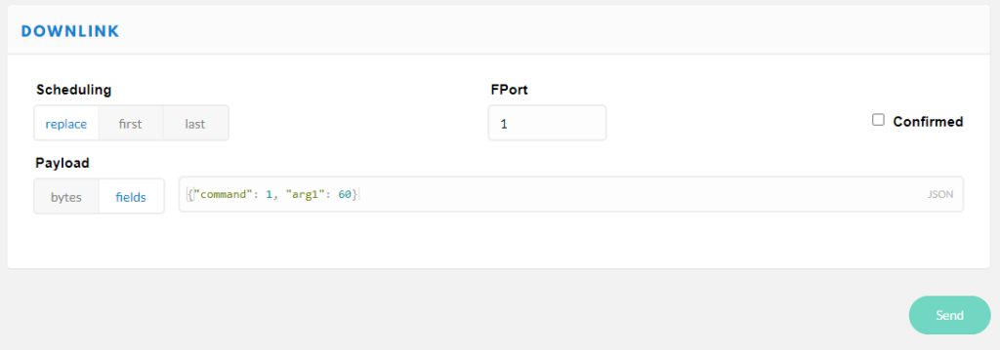

# JLogger-601

<!-- *By Jaimy | November 19, 2020* -->



## Description

I really wanted a go-to device for remotely monitoring a variety of sensors. I often need to monitor and log data from precision analog sensors like strain gauges, load cells, potentiometers, and thermocouples; as well as digital sensors over I2C and serial. I also usually have to do this in some pretty remote places where power may not be available, or is unreliable.

This board is designed for ultra low power, long term remote monitoring using LoRaWan (or raw packet radio) for long range communication. It utilizes the ubiquitous SAMD21G18 microcontroller because it's low power, well supported, and stable. Of course it is also Arduino compatible and can be used with the Arduino IDE by installing the board support package and required libraries.

> **Note:** This documentation is currently a work in progress but I wanted to get the basics posted. I will continue to plug in details and plan to do walkthroughs of a couple more examples.

#### Basic Specifications

- 6 differential 24-bit analog inputs with programmable gain amplifier (1 to 128)
- Sockets for custom input modules on each precision analog input channel
- MOSFET controlled 3.3V output to shut down power to external digital sensors
- 2.5V Excitation voltage can be enabled/disabled in code to save power with analog sensors
- 14 μA sleep current
- 4 high speed 12-bit analog inputs (3.3V)
- 1 x 12-bit analog output (3.3V) (shared pin with AIN0)
- Expansion headers
- Onboard LiPo charger (with trace-jumper to disable charging to allow for non-LiPo batteries)
- Onboard EUI-64 MAC IC
- SAMD21 microcontroller (Arduino Zero/M0 compatible)
- Optional RFM95 LoRa radio module
- Micro SD card slot
- Real Time Clock with battery backup
- USB-C connector for programming and charging

## Pinouts

External connections include 6 precision analog input groups in addition to standard IO and communication terminals and the usual 2 mm JST battery connector.



There are also internal expansion headers for digital IO and a 10 pin SWD debug header along with sockets for analog input modules that can be used for additional signal conditioning like bridge completion, bias resistors, or filtering. A few of the expansion header pins are shared with the external connections. The I²C SDA and SCL lines are shared so that a "shield" type add on board can have access to the I²C bus. The A0/DAC line is also shared so that the DAC can be accessed internally if needed.



---

#### Summary of Internal Pin Connections

Pins for the onboard hardware interfaces have #defines in the board support package. Below is a summary of the defined names, and their corresponding Arduino IDE pin number.

| Peripheral Pin | Defined in BSP | Pin # |
|---------------|----------------|-------|
| RFM95 Chip Select | PIN_RFM_CS | 2 |
| RFM95 Reset | PIN_RFM_RST | 27 |
| RFM95 DIO0 | PIN_RFM_DIO_0 | 7 |
| RFM95 DIO1 | PIN_RFM_DIO_1 | 38 |
| AD7794 Chip Select | PIN_AD7794_CS | 6 |
| AD7794 Data Ready | PIN_AD7794_RDY | 8 |
| Excitation Enable | PIN_EX_EN | 26 |
| Blue LED | PIN_BLUE_LED | 25 |
| Bus Voltage Monitor | PIN_BUS_V | A5 |
| Switched 3.3V Enable | PIN_SW_3V_EN | 5 |

---

## Arduino IDE Support

In the Arduino IDE click *File->Preferences->Settings*





Paste in the following URL to tell the boards manager where to find json file

[https://NHBSystems.github.io/nhb_arduino_boards/package_NHBSys_index.json](https://nhbsystems.github.io/nhb_arduino_boards/package_NHBSys_index.json)

Now you can go into the Arduino Boards Manager, find the JLogger support package, and install it.



Once installed, you may want to select the board and upload the blink example sketch to check that things are working.

## Required Libraries

Additionally you will need to install some libraries to use the onboard hardware, some may depend on how you intend to use the JLogger. In the future I hope to include some of this functionality into an all in one library similar to what Adafruit did for their Circuit Playground boards. Everything except the RadioHead library is available in the Arduino library manager.

#### Required

- RTCZero
- NHB_AD7794
- Adafruit_SPIFlash (will also install Adafruit fork of SDFat)
- extEEPROM

#### You will also want one or more of the following for radio support, depending on your need

- [RadioHead](https://www.airspayce.com/mikem/arduino/RadioHead/)
- MCCI LMIC LoRaWan Library
- Beelan LoRaWAN
- *Some other library?*

## Example Sketches

Additional hardware specific examples are provided for LMIC and Beelan LoRaWan libraries. I hope to add a nice example for RadioHead in the future, but I know the standard examples will work fine as long as you set the pin mappings. The JLogger_601_Test_All example shows the basics of using the onboard hardware and can be used to check that everything is working. It also can be configured to use the RadioHead library to check that an RFM95 (or RFM69) is present and working.

The example sketches can be cloned or downloaded from this repository: [https://github.com/NHBSystems/JLogger-601-Examples](https://github.com/NHBSystems/JLogger-601-Examples)

### Testing the Hardware

The *JLogger_601_Test_All* example is nice way to see initialization and basic use of the JLogger's hardware.

If you have installed the RadioHead library, you can uncomment the appropriate *HAS_RFMxx_RADIO* line near the top of the file. The example will simply try to initialize the radio and set the frequency to check that the radio is present and working. It does not do any actual communication.

```cpp
//#define HAS_RFM95_RADIO       // You must have the Radiohead library installed.
//#define HAS_RFM69_RADIO
#define RFM_FREQUENCY  915.00   // If testing radio, set frequency for your region
```

If for some reason you would like to skip testing any of the other hardware, you can comment out any of the following lines and the test will be skipped.

```cpp
#define HAS_24AA025E64_CHIP     // Included on all boards now
#define TEST_FLASH  
#define TEST_LEDS
#define TEST_AD7794
#define TEST_SW3V
```

The tests are all run in setup() and will do the following.

1. The sketch will flash a fun pattern with all the LEDs (except the charge indicator of course).
2. Test the MOSFET controlled 3.3V output (SW_3V) by switching it on for 2 seconds. You can use a voltmeter or connect an LED to verify that its working.
3. If you have the RadioHead library installed and have enabled the radio test, the example will then try to initialize the radio and set the frequency.
4. Test the 24AA025E64 EUI & EEPROM chip. The sketch will read the EUI, format it, and print it out to serial. (You may want to write it down somewhere if setting up LoRaWan later)
5. Test the SPI Flash storage. Uses the Adfruit_SPIFlash library to read the JEDEC ID and flash size from the device and print them out to serial.
6. Test the AD7794 ADC. Uses the NHB_AD7794 library to initialize the AD7794 and read all 6 channels plus the onboard temperature sensor.

### BeeLan LoRaWan Library

The *JLogger-601_LoraWan_Example-BeelanLib* example should help you get started with LoRaWAN using the [Beelan LoRaWAN library](https://github.com/BeelanMX/Beelan-LoRaWAN) and OTAA activation. It's a nice little library for a simplified application that just needs to get data to the server and maybe receive some downlinks. It however does not handle MAC commands and is not fully compliant with the LoRaWAN specification. This doesn't matter to much for many applications, especially if you are running your own server. This example also shows how to put JLogger to sleep between readings, and processing downlink commands.

The library can be installed from the Arduino library manager or cloned/downloaded from it's GitHub repository (linked above). As I write this, the example has been tested with version 1.5.1.

Near the top of the sketch there is a #define for the default sleep interval (in Seconds) that you can change if you would like the logger to start up with a different interval. If using a third party LoRaWAN server (e.g. The Things Network) be sure to respect their fair use or traffic policies.

```cpp
#define DEFAULT_INTERVAL    30     //Interval we start at
```

A few lines below that you will find the OTAA credentials. The devEUI will be provided by the onboard 24AA025E64 MAC chip, however **you must change** the appEUI and appKey values to those used for your application. I use a private Chirpstack server which does not use an appEUI. The Things Network on the other hand does use it and will generate the value for you. A detailed guide to setting up the server side is beyond the scope of this guide but you can find information on setting up a new device on The Things Network [here](https://www.thethingsnetwork.org/docs/devices/registration.html), and setting up a device on Chirpstack [here](https://www.chirpstack.io/application-server/use/applications/). I may do a more detailed post on setting these up in the future (especially Chirpstack) but for now I'm going to assume that you have access to a LoRaWAN server.

```cpp
//// OTAA credentials /////////////////////////////
char devEui[16];  //WE will fill this with EUI from 24AA025E64 chip
/**************** YOU NEED TO SET THESE! *********/
const char *appEui = "0000000000000000"; //Chirpstack doesn't need this, but need for TTN
const char *appKey = "00000000000000000000000000000000"; //<- You need to change this
```

A little further down we set the pin mapping between the library and the JLogger-601. If you are adapting the example to use with other hardware you will have to change these.

```cpp
//Pin mapping for JLogger 601
const sRFM_pins RFM_pins = {
  .CS = PIN_RFM_CS,      //2,
  .RST = PIN_RFM_RST,    //27,
  .DIO0 = PIN_RFM_DIO_0, //7,
  .DIO1 = PIN_RFM_DIO_1, //38,
  .DIO2 = 255, //Not connected
  .DIO5 = 255, //Not connected
};
```

#### Setup

In setup() we start with the following line to enable proper float support for the sprintf() function.

```cpp
asm(".global _printf_float"); // Enable sprintf float support
```

If SERIAL_DEBUG has been defined the sketch will just sit and wait for a serial connection at this point, and then set the analog read resolution to 12 bit. This is the SAMD21 analog, not the AD7794. In this example it is used for measuring bus/battery voltage.

Now we initialize the 24AA025E64 MAC chip..

```cpp
//Initialize the 24AA025E64 
  uint8_t eepStatus = eep.begin(eep.twiClock400kHz);   //go fast!
  if (eepStatus) {
    #ifdef SERIAL_DEBUG
      Serial.print(F("extEEPROM.begin() failed, status = "));
      Serial.println(eepStatus);
    //while (1);
    #endif
  }
```

.. Then read the EUI64 and convert it to a C style string of HEX numbers. This is the format required by the Beelan library but it also makes it easier to print out nicely.

```cpp
//Read the EUI
  eep.read(EUI64_MAC_ADDR, eui, EUI64_MAC_LENGTH); 

  //...And convert it to a HEX string
  char buf[3];
  for(int i=0;i<8;i++){
    sprintf(buf, "%02x",eui[i]);   
    devEui[i*2] = buf[0];
    devEui[i*2 + 1] = buf[1];
  }
  devEui[16] = 0; //NULL Termination
  
  #ifdef SERIAL_DEBUG
    Serial.print(F("devEUI: "));
    Serial.println(devEui);
  #endif
```

Next we initialize the RTC library and sync *nextAlarmSec* and *nextAlarmMin* to the rtc time. These variables are used to schedule the next wake up time for each sleep cycle. Note that the RTC is not set to the actual time in this example, we are just using it to keep track time intervals so the absolute time doesn't really matter.

```cpp
 //Initialize RTC
  rtc.begin();

  //Set  to actual time here if needed

  nextAlarmSec = rtc.getSeconds();
  nextAlarmMin = rtc.getMinutes();
```

Then initialize the AD7794 and configure the channels. In this example we set all 6 channels to bipolar mode and a gain of 128. This would be appropriate for most bridge type sensors.

```cpp
  // Initialize the AD7794
  // Setup for bridge type sensors (e.g. load cell or pressure gauge)
  // Set update rate to 19.6, 90 dB noise rejection at 60 Hz
  // Set bipolar mode
  // Set set all channels to a gain of 128
  adc.begin();
  adc.setUpdateRate(16.6); //< Slow, but 16.6Hz rate enables 50/60hz noise rejection
  for(int i=0; i < 6; i++){
    adc.setBipolar(i,true);
    //delay(2);
    adc.setGain(i, 128);
    //delay(2);
    adc.setEnabled(i,true);
    //delay(2);
  }
```

Now initialize the radio. If this fails, the code just enters an infinite loop and blinks the built in red LED since there is no point in continuing on.

```cpp
//Initialize radio and LoRaWAN
  if(!lora.init()){
    #ifdef SERIAL_DEBUG
      Serial.println("RFM95 not detected");
    #endif
    delay(1000);
    while(1){
      //Just freak out
      digitalWrite(LED_BUILTIN,LOW);
      delay(500);
      digitalWrite(LED_BUILTIN,HIGH);
      delay(1000);
    }    
  }
```

.. Setup the LoRaWAN parameters. We are a going to be Class A device and we set the modulation to Spread Factor 7, 125 KHz bandwidth. This should be fine for experimenting around the house (probably a lot further) and will hog less airtime. If you are going for longer ranges, you may wish to change this. Just keep in mind that a larger Spread Factor will increase time on air.

```cpp
// Set LoRaWAN Class change CLASS_A or CLASS_C
  lora.setDeviceClass(CLASS_A);

  // Set Data Rate
  lora.setDataRate(SF7BW125);

  // set channel to random
  lora.setChannel(MULTI);
  
  // Put OTAA Key and DevAddress here
  lora.setDevEUI(devEui);
  lora.setAppEUI(appEui);
  lora.setAppKey(appKey);
```

.. And try to join the network. The sketch will endlessly attempt to join every 5 seconds until successful. This is probably way to short an interval but this is just an example. Once joined execution moves on to our main loop.

```cpp
//Join procedure
  bool isJoined;
  do {
    #ifdef SERIAL_DEBUG
      Serial.println("Joining...");
    #endif 
    isJoined = lora.join();
    
    //wait for 5s to try again
    delay(5000);
  }while(!isJoined);
  
  #ifdef SERIAL_DEBUG
    Serial.println("Joined to network");
  #endif
```

#### Main Loop

The main program loop is pretty straightforward. Basically we read the analog inputs, pack up the data, send it out, and go to sleep. All sensor readings are stored in the float array *readings[]*.

First we turn on the 2.5V excitation voltage to power connected bridge sensors

```cpp
digitalWrite(PIN_EX_EN,LOW); //Turn on excitation
```

Then read the bus voltage.

```cpp
readings[0] = getBusVoltage();
```

The *getBusVoltage()* function a little more complicated than you might expect due to the high source impedance of the 1Meg resistors I used in the voltage divider. Many of the development boards out there use 100k or even 10k resistors in a voltage divider to measure battery voltage. The problem with this is that it is a terrible waste of power for long term battery powered applications. I used 1M resistors to reduce that power drain down to around 2 uA, however this causes significant errors in the ADC readings because the default ADC configuration can't handle such high source impedance. The workaround is to change the ADC configuration to a much slower conversion rate that can handle the high impedance, take the reading, and then change it back. Here is the function

```cpp
float getBusVoltage(){
  
  //Increase the sample period to increase allowable
  //source impedance
  REG_ADC_SAMPCTRL = ADC_SAMPCTRL_SAMPLEN(32);
  while (ADC->STATUS.bit.SYNCBUSY == 1);

  //Take the reading
  float val = ((analogRead(PIN_BUS_V) * 3.3) / 4096) *2;

  //Now put it back to reset value
  REG_ADC_SAMPCTRL = ADC_SAMPCTRL_SAMPLEN(0);
  while (ADC->STATUS.bit.SYNCBUSY == 1);

  return val;
}
```

Of course this isn't 100% necessary if you just want to know if you are running out of batteries soon. It should also be noted that bus voltage is measured after a Schottky diode when running on battery, so the voltage will read ~0.2V lower than the actual battery voltage

Next we read the AD7794. We read the on-chip temperature sensor first. Calling read on channel 6 will return the temperature reading in Degrees C. Then we loop through channels 0-5 to get our 6 24bit analog readings and turn the excitation back off to save power.

```cpp
  //Read AD7794 chip temperature
  readings[1] = adc.read(6);

  //Read 6 ADC channels
  for(int i=0; i < 6; i++){
    readings[i+2] = adc.read(i);
  }
  digitalWrite(PIN_EX_EN,HIGH); //Turn off excitation
```

And now we can send the readings out. This example takes a "Keep It Simple" approach to sending out the data. I simply *memcpy()* the *readings* array into *sendBuffer* and then send it out. You have to be aware of [endianness](https://en.wikipedia.org/wiki/Endianness), but this is for a specific architecture, and you have to provide your own JavaScript decode function on the server side anyway.

```cpp
//Pack it up...
memcpy(sendBuffer, readings, sizeof(readings)); 

//...and ship it out  
lora.sendUplink(sendBuffer, sizeof(sendBuffer), 0,1);  //This function has changed to include the mport arg
                                                       //in the 1.5+ Version of the library. 
                                                       
//lora.sendUplink(sendBuffer, sizeof(sendBuffer), 0);  //Earlier library versions
```

*The decode/encode functions to use with this example are provided in comments at the end of the code, and will be listed later in this post.*

Next we update the LoRaWAN state machine..

```css
lora.update();
```

.. and check to see if we have a downlink message. If we did call *parseDownlink()* to handle it and then blink the blue LED to show that we received a downlink message.

```cpp
// Get reply and parse ///////////////////// 
  recvStatus = lora.readData(recvBuffer);      
     
  if(recvStatus) {
    parseDownlink(recvBuffer);
    
    //Blink LED to show we got a downlink
    digitalWrite(PIN_BLUE_LED,LOW);
    delay(500);
    digitalWrite(PIN_BLUE_LED,HIGH);
  }
```

The *parseDownlink()* function is provided as an example of how you can handle commands sent from your application. The first byte of the buffer sent be the server/application is the "command byte" and the rest is payload. The meaning of the payload will depend on the command. This allows for up to 255 commands. On the server/application side an encode function will take a JSON formatted command and convert it to a compatible byte array. There is just one command in this example, which sets the tx/sleep interval, but you could easily add more by following the pattern.

```cpp
void parseDownlink(char * buf){
  
  //Struct to represent simple message
  struct dlMessage_t{
    uint8_t   cmd;
    uint8_t   payload[32]; //Need to look into actual appropriate max payload size
  } message;

  memset(message.payload,0,sizeof(message.payload));  
  memcpy(&message, buf, sizeof(buf));
  
  //Debug info
  #ifdef SERIAL_DEBUG
    Serial.print(F("Message received [ "));
    Serial.print(F("cmd: "));
    Serial.print(message.cmd,HEX);
    Serial.print(F(" Payload: "));
    for(int i=0;i<sizeof(message.payload);i++){
      Serial.print(message.payload[i],HEX);
      Serial.print(' ');
    }
    Serial.println(" ]");
  #endif
  
  // We only have one command for now, but more can be added
  // easily with additional if() statements.

  // Set the transmit interval
  if(message.cmd == DLCMD_SET_RATE){
    
    //We got it! 
    digitalWrite(PIN_BLUE_LED,LOW);
    delay(1000);
    digitalWrite(PIN_BLUE_LED,HIGH);
    
    uint16_t arg1; 
    arg1 =  message.payload[1] | message.payload[0] << 8 ;    
    
    #ifdef SERIAL_DEBUG
      Serial.print("arg1 = ");
      Serial.println(arg1,BIN);
    #endif
 
    //TODO: Set sleep interval here 
    if((arg1 >= MIN_INTERVAL) && (arg1 < MAX_INTERVAL)){
      sleepInterval = arg1;
      //Just re-sync these whenever we change the interval to avoid timing issues
      nextAlarmSec = rtc.getSeconds();
      nextAlarmMin = rtc.getMinutes();
      
      #ifdef SERIAL_DEBUG
        Serial.print(F("Set inteval to "));
        Serial.println(arg1);
      #endif
    }
    
  }else{
    //Unknown command
    #ifdef SERIAL_DEBUG
      Serial.println(F("Unknown command"));
    #endif
    
  }
  
}
```

*Note: Normally you could do the same thing with the port field in the LoRaWAN packet instead of creating your own command byte, but the Beelan library doesn't support extracting ports from the downlink message (yet?)*

Once we have dealt with any downlinks we are ready to go back to sleep. First we calculate the minutes and seconds for when we want to wake up based on our interval. The example is written for intervals of less than 1Hr (3600 sec), but it could be extended to handle larger intervals

```cpp
 nextAlarmSec = (nextAlarmSec + (sleepInterval % 60)) % 60;
 nextAlarmMin = (nextAlarmMin + (sleepInterval / 60)) % 60;
```

Then we set up the RTC alarm and attach the interrupt so we will wake from sleep when the alarm goes off.

```javascript
 if(sleepInterval <= 60){
    rtc.setAlarmSeconds(nextAlarmSec);    
    rtc.enableAlarm(rtc.MATCH_SS); 
  }else{
    rtc.setAlarmSeconds(nextAlarmSec);  
    rtc.setAlarmMinutes(nextAlarmMin);
    rtc.enableAlarm(rtc.MATCH_MMSS);
  }
  
  rtc.attachInterrupt(rtcAlarm);
```

.. and now we turn off the lights and go to sleep. (If SERAIL_DEBUG is defined we just fake it)

```cpp
 digitalWrite(LED_BUILTIN,LOW); 
  #ifdef SERIAL_DEBUG
    Serial.println(F("Going to (Fake) sleep now"));
    delay(sleepInterval * 1000);
    Serial.println(F("Good morning!"));
  #else
    RFM_Sleep(); // Beelan library doesn't put the radio to sleep so do it manually

    //rtc.standbyMode(); // <-- Doesn't handle SysTick properly 
    
    goToSleep(); // Safe sleep function. Could probably also use ArduinoLowPower library    
  #endif  
  digitalWrite(LED_BUILTIN,HIGH); //Waste of power, but this is just an example
```

The Beelan library doesn't put the RFM95 radio to sleep so we have to do it manually with the *RFM_Sleep()* function which looks like this.

```cpp
void RFM_Sleep(){

    //Borrowed from the RadioHead library
    const uint8_t RH_RF95_MODE_SLEEP      = 0x00;
    const uint8_t RH_RF95_REG_01_OP_MODE  = 0x01;
    const uint8_t RH_SPI_WRITE_MASK       = 0x80;
    
    //Set NSS pin Low to start communication
    digitalWrite(PIN_RFM_CS,LOW);

    //Send Addres with MSB 1 to make it a write command
    SPI.transfer(RH_RF95_REG_01_OP_MODE | RH_SPI_WRITE_MASK);
    //Send Data
    SPI.transfer(RH_RF95_MODE_SLEEP);

    //Set NSS pin High to end communication
    digitalWrite(PIN_RFM_CS,HIGH);
}
```

Also, there is bug with the RTCZero library on the SAMD21 that will eventually cause it to lock up and not recover from sleep mode. The issue and solution are documented [here](https://community.atmel.com/comment/2625116#comment-2625116). Because of this I put the microcontroller to sleep manually with the goToSleep() function which properly handles the SysTick interrupt.

```cpp
void goToSleep(){
  bool restoreUSBDevice = false;

 //Try to handle attached USB gracefully
  if (SERIAL_PORT_USBVIRTUAL) {
    USBDevice.standby();
  } else {
    USBDevice.detach();
    restoreUSBDevice = true;
  }
  
  //Disable SysTick interupt
  SysTick->CTRL &= ~SysTick_CTRL_TICKINT_Msk;

  //Go to sleep
  SCB->SCR |= SCB_SCR_SLEEPDEEP_Msk;
  __DSB();
  __WFI();
  //Code starts here after waking

  //Reenable systick interrupt
  SysTick->CTRL |= SysTick_CTRL_TICKINT_Msk;
 
  if (restoreUSBDevice) {
    USBDevice.attach();
  }  
}
```

*You could also use the [ArduinoLowPower](https://github.com/arduino-libraries/ArduinoLowPower/blob/master/src/samd/ArduinoLowPower.cpp) library as the SysTick fix was added into it's sleep method in May of 2019 and is now essentially the same as the code above.*

And that's it, the sketch will just keep repeating that cycle.

#### JavaScript Encode/Decode Functions

Example Javascript Decode/Encode functions for Chirpstack. This will also work for TTN but you have to change the decode signature slightly to *Decoder(bytes, port)*

The *bytesToFloat()* function comes from [here](https://www.thethingsnetwork.org/forum/t/decode-float-sent-by-lopy-as-node/8757/2). It is used to convert a group of 4 bytes into a float. It's pretty simplistic doesn't and do anything to handle weird stuff like NaNs, but it's fine for this example. (I have run it for months without any issues)

```javascript
function bytesToFloat(bytes) {
  // JavaScript bitwise operators yield a 32 bits integer, not a float.
  // Assume LSB (least significant byte first).
  var bits = bytes[3]<<24 | bytes[2]<<16 | bytes[1]<<8 | bytes[0];
  var sign = (bits>>>31 === 0) ? 1.0 : -1.0;
  var e = bits>>>23 & 0xff;
  var m = (e === 0) ? (bits & 0x7fffff)<<1 : (bits & 0x7fffff) | 0x800000;
  var f = sign * m * Math.pow(2, e - 150);
  return f;
  
  // The "bias" value, which is documented to be 127 for 32 bits single-precision 
  // IEEE-754 floating point, has been replaced by 150 in m * Math.pow(2, e - 150). 
  // This is effectively m × 2-23 × 2e-127 a.k.a. (m / 223) × 2e-127, and is a nice 
  // optimization to get the 24th implicit leading bit in the "mantissa".
}  
```

The *Decode()* function is specifically for this example and will decode raw bytes into a JSON object containing battery voltage, temperature, and all 6 AIN channels from the AD7794. If using Chirpstack the signature is *Decode(fPort, bytes)*, if TTN the signature is *Decoder(bytes, port)*.

```javascript
//function Decoder(bytes, port) {   // For The Things Network
function Decode(fPort, bytes){   //For Chirpstack
  var payloadObj = {"BattVoltage":"",
                    "Temperature":"",
                    "Ch_0":"",
                    "Ch_1":"",
                    "Ch_2":"",
                    "Ch_3":"",
                    "Ch_4":"",
                    "Ch_5":""};
  
  //var floats = new Float32Array(2);
  var b = 0;
  payloadObj.BattVoltage = bytesToFloat(bytes.slice(b, b+=4));
  payloadObj.Temperature = bytesToFloat(bytes.slice(b, b+=4));
  payloadObj.Ch_0 = bytesToFloat(bytes.slice(b, b+=4));
  payloadObj.Ch_1 = bytesToFloat(bytes.slice(b, b+=4));
  payloadObj.Ch_2 = bytesToFloat(bytes.slice(b, b+=4));
  payloadObj.Ch_3 = bytesToFloat(bytes.slice(b, b+=4));
  payloadObj.Ch_4 = bytesToFloat(bytes.slice(b, b+=4));
  payloadObj.Ch_5 = bytesToFloat(bytes.slice(b, b+=4));
  
  return payloadObj;
}
```

Finally, the *Encode()* function will take a JSON formatted command/argument pair and convert it to the 1 byte command value, and a 2 byte (uint_16) argument. (The syntax will be covered further down)

```javascript
function Encode(fPort, obj) {
  var bytes = [];
  
  bytes[0] = obj.command & 0xFF;
  
  bytes[1] = (obj.arg1 >> 8) & 0xFF;
  bytes[2] = obj.arg1 & 0xFF;

  return bytes; 
}
```

If using Chirpstack, the functions need to be pasted into the CODEC section in your device profile.



If using The Things Network you add the encode and decode functions under Payload Formats in your application.



In this example there is only one valid command which is to change the TX interval. The byte value for the command is defined as 1 and it takes one argument, the interval in seconds. To set the TX interval to 60 seconds, the syntax to send the command would look like this.

```json
{"command": 1, "arg1": 60}
```

Here is what it looks like in the Chirpstack Application Server web interface (found at Applications->YourApp->Devices->YourDevice)



And this is The Things Network console



---

### TODO: LMIC LoRaWan Example

---
